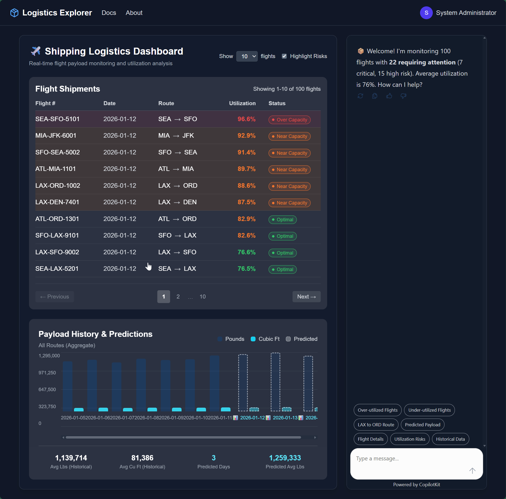

# Nexus: Conversational Analytics Dashboard

An AI-powered logistics dashboard that combines conversational interfaces with real-time data visualization. Built with [Microsoft Agent Framework](https://aka.ms/agent-framework) for agent orchestration and [CopilotKit](https://www.copilotkit.ai/) for the conversational UI, connected via the [AG-UI protocol](https://pypi.org/project/agent-framework-ag-ui/).



## Repository Structure

| Directory | Description |
|-----------|-------------|
| [`backend/api`](backend/api/) | FastAPI + Microsoft Agent Framework (MAF) backend. Hosts the logistics agent, REST endpoints, and AG-UI SSE stream for CopilotKit communication. |
| [`backend/mcp`](backend/mcp/) | MCP (Model Context Protocol) server. Provides flight data via DuckDB with both REST API and MCP protocol endpoints for AI agents. |
| [`backend/agent-a2a`](backend/agent-a2a/) | A2A (Agent-to-Agent) recommendations agent. Provides logistics recommendations when called by the main agent. |
| [`frontend`](frontend/) | Next.js 16 + React 19 dashboard with CopilotKit integration. Provides the conversational UI and data visualization. |
| [`infra`](infra/) | Terraform infrastructure-as-code for Azure deployment. Provisions Container Apps, AI Foundry, and supporting resources. |
| [`monitoring`](monitoring/) | Observability tools including an Azure dashboard for Application Insights traces and a local OpenTelemetry stack (Grafana Tempo). |
| [`scripts`](scripts/) | Setup and utility scripts for app registration, environment configuration, and local development. |

## Architecture

```
┌─────────────────────────────────────────────────────────────────────┐
│                           Frontend (Next.js)                         │
│                   CopilotKit React Components                        │
│                         Port: 3000                                   │
└────────────────────────────────┬────────────────────────────────────┘
                                 │ AG-UI Protocol (SSE)
                                 ▼
┌─────────────────────────────────────────────────────────────────────┐
│                      Backend API (FastAPI + MAF)                     │
│                   Logistics Agent + Tools                            │
│                         Port: 8000                                   │
└────────────────────────────────┬───────────────────────────────────┘
                                 │ HTTP (REST)
                                 ▼
┌─────────────────────────────────────────────────────────────────────┐
│                        MCP Server (Starlette)                        │
│                   Flight Data (DuckDB + REST)                        │
│                         Port: 8001                                   │
└─────────────────────────────────────────────────────────────────────┘
```

## Documentation

- **[Getting Started](media/docs/getting-started.md)** - Prerequisites, installation, configuration, and running the application locally
- **[AG-UI and CopilotKit Features](media/docs/ag-ui-features.md)** - Overview of AG-UI protocol features demonstrated in this application

## Quickstart

### 1. Deploy Azure Infrastructure

The backend requires Azure AI Foundry for LLM access. Follow the steps in [infra/README.md](infra/README.md) to:

1. Create Azure AD App Registrations for authentication
2. Configure Terraform variables
3. Deploy Azure resources (Container Apps, AI Foundry, Application Insights)

> **Note**: For local development, you can set `auth_enabled = false` to skip authentication setup.

### 2. Create Environment Files

Create `.env` files for each module using the values from your Azure deployment:

**backend/api/.env**
```env
# Azure AI Configuration (required)
AZURE_AI_PROJECT_ENDPOINT=https://<your-ai-foundry>.api.azureml.ms
AZURE_AI_MODEL_DEPLOYMENT_NAME=gpt-4o-mini

# Authentication (optional for local dev)
AZURE_AD_CLIENT_ID=<frontend-app-registration-client-id>
AZURE_AD_TENANT_ID=<your-tenant-id>
AUTH_ENABLED=false

# Service URLs
MCP_SERVER_URL=http://localhost:8001
RECOMMENDATIONS_AGENT_URL=http://localhost:5002

# Telemetry (optional)
ENABLE_INSTRUMENTATION=true
APPLICATIONINSIGHTS_CONNECTION_STRING=<from-terraform-output>
```

**backend/mcp/.env**
```env
AUTH_ENABLED=false
```

**backend/agent-a2a/.env**
```env
# Azure AI Configuration (required)
AZURE_AI_PROJECT_ENDPOINT=https://<your-ai-foundry>.api.azureml.ms
AZURE_AI_MODEL_DEPLOYMENT_NAME=gpt-4o-mini
```

**frontend/.env.local**
```env
# API URL
AGENT_API_BASE_URL=http://localhost:8000

# Authentication (optional for local dev)
NEXT_PUBLIC_AZURE_AD_CLIENT_ID=<frontend-app-registration-client-id>
NEXT_PUBLIC_AZURE_AD_TENANT_ID=<your-tenant-id>
NEXT_PUBLIC_AUTH_ENABLED=false

# Telemetry (optional) - use instrumentation key instead of full connection string
NEXT_PUBLIC_APPINSIGHTS_INSTRUMENTATION_KEY=<from-terraform-output>
NEXT_PUBLIC_APPINSIGHTS_INGESTION_ENDPOINT=<optional-ingestion-endpoint>
```

### 3. Run the Application

#### Option A: Using npm (recommended for development)

```bash
# Install all dependencies (frontend + backend)
npm install

# Start all services concurrently
npm run dev
```

This starts:
- **[ui]** Next.js frontend on http://localhost:3000
- **[mcp]** MCP server on http://localhost:8001
- **[a2a]** A2A agent on http://localhost:5002
- **[api]** Backend API on http://localhost:8000

#### Option B: Using Docker Compose

Next.js requires `NEXT_PUBLIC_*` environment variables at **build time** (they're baked into the client bundle). Use `--env-file` to pass your frontend configuration:

```bash
# Build and start all services (with frontend env vars)
docker compose --env-file frontend/.env.local up --build

# Or start in detached mode
docker compose --env-file frontend/.env.local up -d --build

# View logs
docker compose logs -f

# Stop all services
docker compose down
```

> **Note**: If you skip `--env-file`, the frontend will use placeholder values and authentication will fail.

### 4. Access the Application

Open http://localhost:3000 in your browser. You should see the logistics dashboard with the chat interface.

Try asking:
- "Show me flights with low utilization"
- "What routes have high risk?"
- "Analyze the current data"

## License

See [LICENSE](LICENSE) for details.

