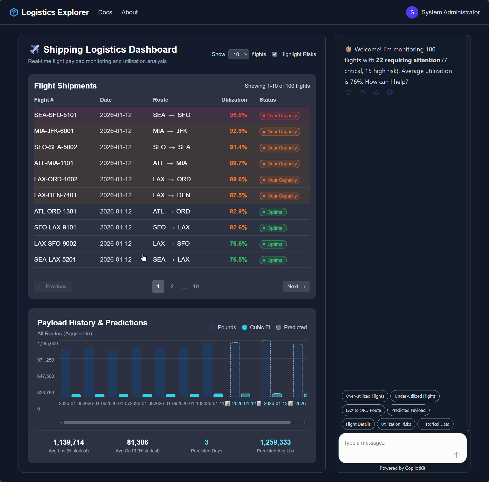

# Nexus: Conversational Analytics Dashboard

An AI-powered logistics dashboard that combines conversational interfaces with real-time data visualization. Built with [Microsoft Agent Framework](https://aka.ms/agent-framework) for agent orchestration and [CopilotKit](https://www.copilotkit.ai/) for the conversational UI, connected via the [AG-UI protocol](https://pypi.org/project/agent-framework-ag-ui/).



## Repository Structure

| Directory | Description |
|-----------|-------------|
| [`src/backend/logistics`](src/backend/logistics/) | FastAPI + Microsoft Agent Framework (MAF) backend. Hosts the logistics agent, REST endpoints, and AG-UI SSE stream for CopilotKit communication. |
| [`src/backend/logistics-data`](src/backend/logistics-data/) | MCP (Model Context Protocol) server. Provides flight data via DuckDB with both REST API and MCP protocol endpoints for AI agents. |
| [`src/backend/recommendations`](src/backend/recommendations/) | A2A (Agent-to-Agent) recommendations agent. Provides logistics recommendations when called by the main agent. |
| [`src/frontend`](src/frontend/) | Next.js 16 + React 19 dashboard with CopilotKit integration. Provides the conversational UI and data visualization. |
| [`infra`](infra/) | Terraform infrastructure-as-code for Azure deployment. Provisions Container Apps, AI Foundry, and supporting resources. |
| [`src/monitoring`](src/monitoring/) | Observability tools including an Azure dashboard for Application Insights traces and a local OpenTelemetry stack (Grafana Tempo). |
| [`src/scripts`](src/scripts/) | Setup and utility scripts for app registration, environment configuration, and local development. |

## Architecture

```
┌─────────────────────────────────────────────────────────────────────┐
│                           Frontend (Next.js)                         │
│                   CopilotKit React Components                        │
│                         Port: 3000                                   │
└────────────────────────────────┬────────────────────────────────────┘
                                 │ AG-UI Protocol (SSE)
                                 ▼
┌─────────────────────────────────────────────────────────────────────┐
│                      Backend API (FastAPI + MAF)                     │
│                   Logistics Agent + Tools                            │
│                         Port: 8000                                   │
└────────────────────────────────┬───────────────────────────────────┘
                                 │ HTTP (REST)
                                 ▼
┌─────────────────────────────────────────────────────────────────────┐
│                        MCP Server (Starlette)                        │
│                   Flight Data (DuckDB + REST)                        │
│                         Port: 8001                                   │
└─────────────────────────────────────────────────────────────────────┘
```

## Azure Infrastructure Topology

### Private Networking Architecture

All Azure services communicate over a private VNet with no public endpoints exposed for backend data services. The networking is structured across four subnet roles:

| Subnet role | Purpose |
|-------------|---------|
| Container Apps infrastructure subnet | Container Apps Environment (delegated to `Microsoft.App/environments`) |
| Private endpoint subnet | Private endpoints for all PaaS services |
| Foundry injection subnet | AI Foundry Agent Service network injection (delegated to `Microsoft.App/environments`) |
| Utility subnet | Utility/jumpbox VM access for private network diagnostics |

### AI Foundry Agent Service — Capability Hosts

The Foundry Agent Service uses a two-tier **capability host** chain to enable Cosmos DB-backed session/thread storage:

```
AI Foundry Account
  └── capabilityHost (account-level)          ← required prerequisite for project capability host
        ├── capabilityHostKind: Agents
        └── customerSubnet: <foundry-injection-subnet>

AI Foundry Project
  └── capabilityHost (project-level)          ← wired to BYO data services
        ├── storageConnections: [blob storage]
        ├── threadStorageConnections: [cosmos db]
        └── vectorStoreConnections: [ai search]
```

**Network injection** routes all agent service traffic through the Foundry injection subnet. This subnet must be delegated to `Microsoft.App/environments` for the capability host to accept the customer subnet.

> **Important**: In a standard private networking deployment, the platform creates the required capability-host chain as part of setup. In this repository's current Terraform path (AVM module `Azure/avm-ptn-aiml-ai-foundry/azurerm` with `network_injections` enabled), the account-level capability host may need a one-time bootstrap via Azure REST API (`2025-10-01-preview`) before Terraform can create the project-level capability host.

### Microsoft Learn References

| Topic | Document |
|-------|----------|
| Network isolation overview (inbound + outbound, VNet injection, DNS) | [How to configure network isolation for Microsoft Foundry](https://learn.microsoft.com/en-us/azure/foundry/how-to/configure-private-link) |
| VNet injection step-by-step, subnet delegation, BYO resources, DNS zone table | [Set up private networking for Foundry Agent Service](https://learn.microsoft.com/en-us/azure/foundry/agents/how-to/virtual-networks) |
| Architecture deep-dive: capability host, data proxy, IP allocation, subnet sizing | [Deep dive into Foundry Agent Service networking](https://learn.microsoft.com/en-us/azure/foundry/agents/concepts/agents-networking-deep-dive) |
| Subnet delegation to `Microsoft.App/environments`, sizing, IP reservation rules | [Virtual network configuration – Azure Container Apps](https://learn.microsoft.com/en-us/azure/container-apps/custom-virtual-networks) |

### Bring-Your-Own (BYO) Services

The Foundry project connects to customer-managed instances of each backing service (`create_byor = false`):

| Service | Role | Connection type |
|---------|------|-----------------|
| **Cosmos DB** | Thread/session storage for Foundry Agent conversations | `threadStorageConnections` |
| **Azure Blob Storage** | Agent artifact and file storage | `storageConnections` |
| **Azure AI Search** | Vector store for RAG | `vectorStoreConnections` |

The project's system-managed identity is granted:
- `Cosmos DB Built-in Data Contributor` (scoped to the enterprise memory database)
- `Storage Blob Data Owner` (scoped to project containers)

### Private DNS Zones

All DNS zones are linked to the core VNet and resolve service hostnames to private IP addresses in `snet-private-endpoints`:

| DNS Zone | Service |
|----------|---------|
| `privatelink.services.ai.azure.com` | Azure AI Foundry (primary endpoint) |
| `privatelink.cognitiveservices.azure.com` | Azure AI Foundry (Cognitive Services endpoint) |
| `privatelink.openai.azure.com` | Azure OpenAI model deployments |
| `privatelink.search.windows.net` | Azure AI Search |
| `privatelink.documents.azure.com` | Azure Cosmos DB (SQL API) |
| `privatelink.blob.core.windows.net` | Azure Blob Storage |

The `FOUNDRY_PROJECT_ENDPOINT` env var uses the `.services.ai.azure.com` domain so that Container App traffic resolves via private DNS and routes through the private endpoint rather than the public Cognitive Services hostname.

---

## Documentation

- **[Getting Started](media/docs/getting-started.md)** — Prerequisites, installation, configuration, and running the application locally
- **[Dev Setup](media/docs/dev-setup.md)** — Tooling, Poe tasks, and manual setup instructions
- **[Coding Standard](media/docs/coding-standard.md)** — Code style, anti-slop rules, and quality gates
- **[Contributing](CONTRIBUTING.md)** — Conventional Commits, branch naming, and PR guidelines
- **[Glossary](media/docs/glossary.md)** — Abbreviations and terms used in this project
- **[AG-UI and CopilotKit Features](media/docs/ag-ui-features.md)** — Overview of AG-UI protocol features demonstrated in this application

## Quickstart

### 1. Deploy Azure Infrastructure

The backend requires Azure AI Foundry for LLM access. Follow the steps in [infra/README.md](infra/README.md) to:

1. Create Azure AD App Registrations for authentication
2. Configure Terraform variables
3. Deploy Azure resources (Container Apps, AI Foundry, Application Insights)

> **Note**: For local development, you can set `auth_enabled = false` to skip authentication setup.

Deployment exposure model for this feature:
- Public ingress: frontend and logistics API
- Internal-only ingress: logistics-data (MCP) and recommendations

CI/CD prerequisite for public GitHub-hosted runners:
- Azure Container Registry public network access remains enabled so hosted runners can push and pull deployment images.

### 2. Create Environment Files

Create `.env` files for each module using the values from your Azure deployment:

**src/backend/logistics/.env**
```env
# Azure AI Configuration (required)
FOUNDRY_PROJECT_ENDPOINT=https://<your-ai-foundry>.api.azureml.ms
FOUNDRY_MODEL=gpt-4o-mini
FOUNDRY_AGENT_NAME=logistics-agent
# FOUNDRY_AGENT_VERSION=<optional>

# Authentication (optional for local dev)
AZURE_AD_CLIENT_ID=<frontend-app-registration-client-id>
AZURE_AD_TENANT_ID=<your-tenant-id>
AUTH_ENABLED=false

# Service URLs
MCP_SERVER_URL=http://localhost:8001
RECOMMENDATIONS_AGENT_URL=http://localhost:5002

# Telemetry (optional)
ENABLE_INSTRUMENTATION=true
APPLICATIONINSIGHTS_CONNECTION_STRING=<from-terraform-output>
```

**src/backend/logistics-data/.env**
```env
AUTH_ENABLED=false
```

**src/backend/recommendations/.env**
```env
# Azure AI Configuration (required)
FOUNDRY_PROJECT_ENDPOINT=https://<your-ai-foundry>.api.azureml.ms
FOUNDRY_MODEL=gpt-4o-mini
```

**src/frontend/.env.local**
```env
# API URL
AGENT_API_BASE_URL=http://localhost:8000

# Authentication (optional for local dev)
NEXT_PUBLIC_AZURE_AD_CLIENT_ID=<frontend-app-registration-client-id>
NEXT_PUBLIC_AZURE_AD_TENANT_ID=<your-tenant-id>
NEXT_PUBLIC_AUTH_ENABLED=false

# Telemetry (optional) - use instrumentation key instead of full connection string
NEXT_PUBLIC_APPINSIGHTS_INSTRUMENTATION_KEY=<from-terraform-output>
NEXT_PUBLIC_APPINSIGHTS_INGESTION_ENDPOINT=<optional-ingestion-endpoint>
```

### 3. Bootstrap Local Development

Use the monorepo setup script from the repository root:

```bash
./devsetup.sh
```

The script will:
- verify `uv` is installed
- install Python runtimes (`3.11`, `3.12`, `3.13`) via `uv`
- run `uv sync --dev` for `src/backend/logistics`, `src/backend/logistics-data`, and `src/backend/recommendations`
- install frontend dependencies in `src/frontend` (if Node.js is installed)
- configure local git hooks from `.githooks/`

Optional: pass a Python version label for your local workflow display:

```bash
./devsetup.sh 3.12
```

### 4. Run the Application

#### Option A: Using npm (recommended for development)

```bash
# Start all services concurrently
npm run dev
```

This starts:
- **[ui]** Next.js frontend on http://localhost:3000
- **[mcp]** MCP server on http://localhost:8001
- **[a2a]** A2A agent on http://localhost:5002
- **[logistics]** Backend API on http://localhost:8000

#### Option B: Using Docker Compose

Next.js requires `NEXT_PUBLIC_*` environment variables at **build time** (they're baked into the client bundle). Use `--env-file` to pass your frontend configuration:

```bash
# Build and start all services (with frontend env vars)
docker compose --env-file src/frontend/.env.local up --build

# Or start in detached mode
docker compose --env-file src/frontend/.env.local up -d --build

# View logs
docker compose logs -f

# Stop all services
docker compose down
```

> **Note**: If you skip `--env-file`, the frontend will use placeholder values and authentication will fail.

### 5. Access the Application

Open http://localhost:3000 in your browser. You should see the logistics dashboard with the chat interface.

Try asking:
- "Show me flights with low utilization"
- "What routes have high risk?"
- "Analyze the current data"

## Git Hooks

This repo uses local git hooks in `.githooks/`:

- `pre-commit`: blocks direct commits to `main`/`master`, runs `uv run --project . poe check`, and runs frontend lint when staged changes include `src/frontend/`.
- `pre-push`: runs `uv run --project . poe check` and frontend lint before pushing.
- `commit-msg`: enforces Conventional Commits format.

Hooks are installed automatically by `devsetup.sh`. To install manually:

```bash
git config core.hooksPath .githooks
chmod +x .githooks/*
```

## License

See [LICENSE](LICENSE) for details.
